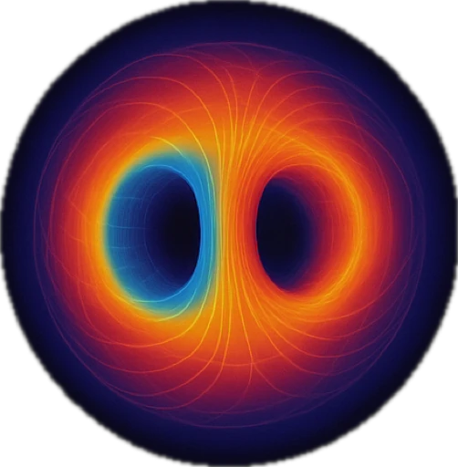

# Awesome Machine Learning in Plasma Physics 

A curated list of awesome machine learning resources for plasma physics, tokamaks, and stellarators.

## Contents

[Research Papers 📚](#research-papers) | [Implementation Papers 💻](#implementation-papers) | [Tools 🛠️](#tools)

## Research Papers

Papers are organized *chronologically* with format ** "**year** - **title** - *authors* - arxiv / journal / conference - link - abstract or summary"

- **2025** - **A generative artificial intelligence framework for long-time plasma turbulence simulations** - *Clavier, B., Zarzoso, D., del-Castillo-Negrete, D., Fr\'{e* - arXiv - [arXiv](https://arxiv.org/abs/https://pubs.aip.org/aip/pop/article-pdf/doi/10.1063/5.0255386/20553361/063905\_1\_5.0255386.pdf) - Generative deep learning techniques are employed in a novel framework for the construction of surrogate models capturing the spatiotemporal dynamics of 2D plasma turbulence. The proposed Generative Artificial Intelligence Turbulence (GAIT) framework enables the acceleration of turbulence simulati... <!-- imported-from-bib -->
- **2025** - **Active ramp-down control and trajectory design for tokamaks with neural differential equations and reinforcement learning** - *Wang, Allen M., Rea, Cristina, So, Oswin, Dawson, Charles, Garnier, Darren T., Fan, Chuchu* - arXiv - [link](https://doi.org/10.1038/s42005-025-02146-6) - The tokamak offers a promising path to fusion energy, but disruptions pose a major economic risk, motivating solutions to manage their consequence. This work develops a reinforcement learning approach to this problem by training a policy to ramp-down the plasma current while avoiding limits on a ... <!-- imported-from-bib -->
- **2025** - **Implementing deep learning-based disruption prediction in a drifting data environment of new tokamak: HL-3** - *Yang, Zongyu, Zhong, Wulyu, Xia, Fan, Gao, Zhe, Zhu, Xiaobo, Li, Jiyuan, Hu, Liwen, Xu, Zhaohe, Li, Da, Zheng, Guohui, Chen, Yihang, Zhang, Junzhao, Li, Bo, Zhang, Xiaolong, Zhu, Yiren, Tong, Ruihai, Dong, Yunbo, Zhang, Yipo, Yuan, Boda, Yu, Xin, He, Zongyuhui, Tian, Wenjing, Gong, Xinwen, Xu, Min* - arXiv - [link](https://dx.doi.org/10.1088/1741-4326/ada396) - A deep learning-based disruption prediction algorithm has been implemented on a new tokamak, HL-3. An Area Under receiver-operator characteristic Curve of 0.940 has been realized offline over a test campaign involving 72 disruptive and 240 non-disruptive shots, despite the limited training data a... <!-- imported-from-bib -->
- **Magnetic control of tokamak plasmas through deep reinforcement learning with privileged information** - *Sorokin et al.* - [OpenReview](https://openreview.net/pdf?id=vp6K02lz4E) - Novel RL approach using privileged information for real-time plasma control, achieving successful control on DIII-D tokamak with 2.2cm LCFS accuracy and 3-second stable operation. Presented at AI4X 2025, Singapore, 8–11 July 2025
- **2025** - **Magnetic control of tokamak plasmas through deep reinforcement learning with privileged information** - *Dmitry Igorevich Sorokin, Alexander A. Granovskiy, Ivan Kharitonov, Maxim Stokolesov, Igor Prokofyev, Evgeny Adishchev, Georgy Subbotin, Maxim Nurgaliev* - arXiv - [link](https://openreview.net/forum?id=vp6K02lz4E) <!-- imported-from-bib -->
- **2025** - **Physics-Informed Deep Learning Model for Line-integral Diagnostics Across Fusion Devices** - *Cong Wang, Weizhe Yang, Haiping Wang, Renjie Yang, Jing Li, Zhijun Wang, Yixiong Wei, Xianli Huang, Chenshu Hu, Zhaoyang Liu, Xinyao Yu, Changqing Zou, Zhifeng Zhao* - arXiv - [arXiv](https://arxiv.org/abs/2412.00087) <!-- imported-from-bib -->
- **2025** - **Physics-informed deep learning model for line-integral diagnostics across fusion devices** - *Wang, Cong, Yang, Weizhe, Wang, Haiping, Yang, Renjie, Li, Jing, Wang, Zhijun, Wei, Yixiong, Huang, Xianli, Hu, Chenshu, Liu, Zhaoyang, Yu, Xinyao, Zou, Changqing, Zhao, Zhifeng* - arXiv - [link](http://dx.doi.org/10.1088/1741-4326/ade0ce) <!-- imported-from-bib -->
- **2025** - **Physics-informed neural networks for the modelling of interferometer-polarimetry in tokamak multi-diagnostic equilibrium reconstructions** - *Rutigliano, Novella, Rossi, Riccardo, Murari, Andrea, Gelfusa, Michela, Craciunescu, Teddy, Mazon, Didier, Gaudio, Pasquale* - arXiv - [link](https://dx.doi.org/10.1088/1361-6587/addde6) - Equilibrium reconstruction is crucial in nuclear fusion and plasma physics, as it enables the understanding of the distribution of fundamental plasma quantities within a reactor. Given that equilibrium reconstruction is an ill-posed problem, it is essential to constrain the algorithm with multipl... <!-- imported-from-bib -->
- **2025** - **Reconstructing the Plasma Boundary with a Reduced Set of Diagnostics** - *M. S. Stokolesov, M. R. Nurgaliev, I. P. Kharitonov, E. V. Adishchev, D. I. Sorokin, R. Clark, D. M. Orlov* - arXiv - [arXiv](https://arxiv.org/abs/2505.10709) <!-- imported-from-bib -->
- **2025** - **Reconstruction-free magnetic control of DIII-D plasma with deep reinforcement learning** - *G. F. Subbotin, D. I. Sorokin, M. R. Nurgaliev, A. A. Granovskiy, I. P. Kharitonov, E. V. Adishchev, E. N. Khairutdinov, R. Clark, H. Shen, W. Choi, J. Barr, D. M. Orlov* - arXiv - [arXiv](https://arxiv.org/abs/2506.13267) <!-- imported-from-bib -->
- **2024** - **A generative machine learning surrogate model of plasma turbulence** - *B. Clavier, D. Zarzoso, D. del-Castillo-Negrete, E. Frenod* - arXiv - [arXiv](https://arxiv.org/abs/2405.13232) <!-- imported-from-bib -->
- **2024** - **A high-density and high-confinement tokamak plasma regime for fusion energy** - *Ding, S., Garofalo, A. M., Wang, H. Q., Weisberg, D. B., Li, Z. Y., Jian, X., Eldon, D., Victor, B. S., Marinoni, A., Hu, Q. M., Carvalho, I. S., Odstr{\v c* - arXiv - [link](https://doi.org/10.1038/s41586-024-07313-3) - The tokamak approach, utilizing a toroidal magnetic field configuration to confine a hot plasma, is one of the most promising designs for developing reactors that can exploit nuclear fusion to generate electrical energy1,2. To reach the goal of an economical reactor, most tokamak reactor designs3... <!-- imported-from-bib -->
- **2024** - **A semi-automated algorithm for designing stellarator divertor and limiter plates and application to HSX** - *Davies, Robert, Feng, Yuhe, Boeyaert, Dieter, Schmitt, John C., Gerard, Michael J., Garcia, Kelly A., Schmitz, Oliver, Geiger, Benedikt, Henneberg, Sophia A.* - arXiv - [link](https://dx.doi.org/10.1088/1741-4326/ad8017) - We present a semi-automated algorithm for designing three-dimensional divertor or limiter plates targeting low heat loads. The algorithm designs the plates in two stages: firstly, the parallel heat flux distribution is caught on vertically-inclined plates at one or several toroidal locations. Sec... <!-- imported-from-bib -->
- **2024** - **Application of Neural Ordinary Differential Equations for Tokamak Plasma Dynamics Analysis** - *Zefang Liu, Weston M. Stacey* - arXiv - [arXiv](https://arxiv.org/abs/2403.01635) <!-- imported-from-bib -->
- **2024** - **Application of interpretable machine learning for cross-diagnostic inference on the ST40 spherical tokamak** - *Tadas Pyragius, Cary Colgan, Hazel Lowe, Filip Janky, Matteo Fontana, Yichen Cai, Graham Naylor* - arXiv - [arXiv](https://arxiv.org/abs/2407.18741) <!-- imported-from-bib -->
- **2024** - **Avoiding fusion plasma tearing instability with deep reinforcement learning** - *Seo, Jaemin, Kim, SangKyeun, Jalalvand, Azarakhsh, Conlin, Rory, Rothstein, Andrew, Abbate, Joseph, Erickson, Keith, Wai, Josiah, Shousha, Ricardo, Kolemen, Egemen* - arXiv - [link](https://doi.org/10.1038/s41586-024-07024-9) - For stable and efficient fusion energy production using a tokamak reactor, it is essential to maintain a high-pressure hydrogenic plasma without plasma disruption. Therefore, it is necessary to actively control the tokamak based on the observed plasma state, to manoeuvre high-pressure plasma whil... <!-- imported-from-bib -->
- **2024** - **Full Shot Predictions for the DIII-D Tokamak via Deep Recurrent Networks** - *Ian Char, Youngseog Chung, Joseph Abbate, Egemen Kolemen, Jeff Schneider* - arXiv - [arXiv](https://arxiv.org/abs/2404.12416) <!-- imported-from-bib -->
- **2024** - **High-Fidelity Data-Driven Dynamics Model for Reinforcement Learning-based Magnetic Control in HL-3 Tokamak** - *Niannian Wu, Zongyu Yang, Rongpeng Li, Ning Wei, Yihang Chen, Qianyun Dong, Jiyuan Li, Guohui Zheng, Xinwen Gong, Feng Gao, Bo Li, Min Xu, Zhifeng Zhao, Wulyu Zhong* - arXiv - [arXiv](https://arxiv.org/abs/2409.09238) <!-- imported-from-bib -->
- **2024** - **Highest Fusion Performance without Harmful Edge Energy Bursts in Tokamak** - *SangKyeun Kim, Ricardo Shousha, SeongMoo Yang, Qiming Hu, SangHee Hahn, Azarakhsh Jalalvand, Jong-Kyu Park, Nikolas Christopher Logan, Andrew Oakleigh Nelson, Yong-Su Na, Raffi Nazikian, Robert Wilcox, Rongjie Hong, Terry Rhodes, Carlos Paz-Soldan, YoungMu Jeon, MinWoo Kim, WongHa Ko, JongHa Lee, Alexander Battey, Alessandro Bortolon, Joseph Snipes, Egemen Kolemen* - arXiv - [arXiv](https://arxiv.org/abs/2405.05452) <!-- imported-from-bib -->
- **2024** - **Learning the dynamics of a one-dimensional plasma model with graph neural networks** - *Carvalho, Diogo D, Ferreira, Diogo R, Silva, Lu\'{\i* - arXiv - [link](http://dx.doi.org/10.1088/2632-2153/ad4ba6) <!-- imported-from-bib -->
- **2024** - **Leveraging physics-informed neural computing for transport simulations of nuclear fusion plasmas** - *J. Seo, I.H. Kim, H. Nam* - arXiv - [link](https://www.sciencedirect.com/science/article/pii/S1738573324003644) - For decades, plasma transport simulations in tokamaks have used the finite difference method (FDM), a relatively simple scheme to solve the transport equations, a coupled set of time-dependent partial differential equations. In this FDM approach, typically over O(105) time steps are needed for a ... <!-- imported-from-bib -->
- **2024** - **Machine Learning Applications to Computational Plasma Physics and Reduced-Order Plasma Modeling: A Perspective** - *Farbod Faraji, Maryam Reza* - arXiv - [arXiv](https://arxiv.org/abs/2409.02349) <!-- imported-from-bib -->
- **2024** - **Multi-Objective Bayesian Optimization for Design of Pareto-Optimal Current Drive Profiles in STEP** - *Brown, Theodore, Marsden, Stephen, Gopakumar, Vignesh, Terenin, Alexander, Ge, Hong, Casson, Francis* - arXiv - [link](http://dx.doi.org/10.1109/TPS.2024.3382775) <!-- imported-from-bib -->
- **2024** - **Neural-Parareal: Dynamically Training Neural Operators as Coarse Solvers for Time-Parallelisation of Fusion MHD Simulations** - *S. J. P. Pamela, N. Carey, J. Brandstetter, R. Akers, L. Zanisi, J. Buchanan, V. Gopakumar, M. Hoelzl, G. Huijsmans, K. Pentland, T. James, G. Antonucci, the JOREK Team* - arXiv - [arXiv](https://arxiv.org/abs/2405.01355) <!-- imported-from-bib -->
- **2024** - **Prediction of plasma rotation velocity and ion temperature profiles in EAST Tokamak using artificial neural network models** - *Lin, Zichao, Zhang, Hongming, Wang, Fudi, Bae, Cheonho, Fu, Jia, Shen, Yongcai, Dai, Shuyu, Jin, Yifei, Lu, Dian, Fu, Shengyu, Ji, Huajian, Lyu, Bo* - arXiv - [link](https://dx.doi.org/10.1088/1741-4326/ad73e8) - Artificial neural network models have been developed to predict rotation velocity and ion temperature profiles on the EAST tokamak based on spectral measurements from the x-ray crystal spectrometer. Both Deep Neural Network (DNN) and Convolutional Neural Network (CNN) models have been employed to... <!-- imported-from-bib -->
- **Sample-efficient Bayesian Optimisation Using Known Invariances** - *Brown et al.* - [NeurIPS 2024](https://proceedings.neurips.cc/paper_files/paper/2024/hash/9f396fe44e7c05de4f78d0e5b9b4fd2b-Abstract-Conference.html) - Sample-efficient Bayesian optimization using known invariances for improved optimization performance
- **2024** - **Sparsified time-dependent Fourier neural operators for fusion simulations** - *Rahman, Mustafa Mutiur, Bai, Zhe, King, Jacob Robert, Sovinec, Carl R., Wei, Xishuo, Williams, Samuel, Liu, Yang* - arXiv - [arXiv](https://arxiv.org/abs/https://pubs.aip.org/aip/pop/article-pdf/doi/10.1063/5.0232503/20281563/123902\_1\_5.0232503.pdf) - This paper presents a sparsified Fourier neural operator for coupled time-dependent partial differential equations (ST-FNO) as an efficient machine learning surrogate for fluid and particle-based fusion codes such as NIMROD (Non-Ideal Magnetohydrodynamics with Rotation - Open Discussion) and GTC ... <!-- imported-from-bib -->
- **2024** - **TORAX: A Fast and Differentiable Tokamak Transport Simulator in JAX** - *Jonathan Citrin, Ian Goodfellow, Akhil Raju, Jeremy Chen, Jonas Degrave, Craig Donner, Federico Felici, Philippe Hamel, Andrea Huber, Dmitry Nikulin, David Pfau, Brendan Tracey, Martin Riedmiller, Pushmeet Kohli* - arXiv - [arXiv](https://arxiv.org/abs/2406.06718) <!-- imported-from-bib -->
- **2024** - **Time Series Viewmakers for Robust Disruption Prediction** - *Dhruva Chayapathy, Tavis Siebert, Lucas Spangher, Akshata Kishore Moharir, Om Manoj Patil, Cristina Rea* - arXiv - [arXiv](https://arxiv.org/abs/2410.11065) <!-- imported-from-bib -->
- **2024** - **Tokamak edge localized mode onset prediction with deep neural network and pedestal turbulence** - *Joung, Semin, Smith, David R., McKee, G., Yan, Z., Gill, K., Zimmerman, J., Geiger, B., Coffee, R., O'Shea, F.H., Jalalvand, A., Kolemen, E.* - arXiv - [link](https://dx.doi.org/10.1088/1741-4326/ad43fb) - A neural network, BES-ELMnet, predicting a quasi-periodic disruptive eruption of the plasma energy and particles known as edge localized mode (ELM) onset is developed with observed pedestal turbulence from the beam emission spectroscopy system in DIII-D. BES-ELMnet has convolutional and fully-con... <!-- imported-from-bib -->
- **2023** - **Automatic identification of edge localized modes in the DIII-D tokamak** - *O'Shea, Finn H., Joung, Semin, Smith, David R., Coffee, Ryan* - arXiv - [arXiv](https://arxiv.org/abs/https://pubs.aip.org/aip/aml/article-pdf/doi/10.1063/5.0134001/16820152/026102\_1\_5.0134001.pdf) - Fusion power production in tokamaks uses discharge configurations that risk producing strong type I edge localized modes. The largest of these modes will likely increase impurities in the plasma and potentially damage plasma facing components, such as the protective heat and particle divertor. Ma... <!-- imported-from-bib -->
- **2023** - **Autoregressive Transformers for Disruption Prediction in Nuclear Fusion Plasmas** - *Lucas Spangher, William Arnold, Alexander Spangher, Andrew Maris, Cristina Rea* - arXiv - [arXiv](https://arxiv.org/abs/2401.00051) <!-- imported-from-bib -->
- **2023** - **Bayesian optimization of massive material injection for disruption mitigation in tokamaks** - *Pusztai, I., Ekmark, I., Bergstr\"{o* - journal - Link not available <!-- imported-from-bib -->
- **2023** - **Disruption prediction for future tokamaks using parameter-based transfer learning** - *Zheng, Wei, Xue, Fengming, Chen, Zhongyong, Chen, Dalong, Guo, Bihao, Shen, Chengshuo, Ai, Xinkun, Wang, Nengchao, Zhang, Ming, Ding, Yonghua, Chen, Zhipeng, Yang, Zhoujun, Shen, Biao, Xiao, Bingjia, Pan, Yuan* - arXiv - [link](https://doi.org/10.1038/s42005-023-01296-9) - Tokamaks are the most promising way for nuclear fusion reactors. Disruption in tokamaks is a violent event that terminates a confined plasma and causes unacceptable damage to the device. Machine learning models have been widely used to predict incoming disruptions. However, future reactors, with ... <!-- imported-from-bib -->
- **2023** - **Fast equilibrium reconstruction by deep learning on EAST tokamak** - *Lu, Jingjing, Hu, Youjun, Xiang, Nong, Sun, Youwen* - arXiv - [arXiv](https://arxiv.org/abs/https://pubs.aip.org/aip/adv/article-pdf/doi/10.1063/5.0152318/18032942/075007\_1\_5.0152318.pdf) - A deep neural network is developed and trained on magnetic measurements (input) and EFIT poloidal magnetic flux (output) on the EAST tokamak. In optimizing the network architecture, we use automatic optimization to search for the best hyperparameters, which helps in better model generalization. W... <!-- imported-from-bib -->
- **2023** - **Fourier Neural Operator for Plasma Modelling** - *Vignesh Gopakumar, Stanislas Pamela, Lorenzo Zanisi, Zongyi Li, Anima Anandkumar, MAST Team* - arXiv - [arXiv](https://arxiv.org/abs/2302.06542) <!-- imported-from-bib -->
- **2023** - **GS-DeepNet: mastering tokamak plasma equilibria with deep neural networks and the Grad--Shafranov equation** - *Joung, Semin, Ghim, Y. -C., Kim, Jaewook, Kwak, Sehyun, Kwon, Daeho, Sung, C., Kim, D., Kim, Hyun-Seok, Bak, J. G., Yoon, S. W.* - arXiv - [link](https://doi.org/10.1038/s41598-023-42991-5) - The force-balanced state of magnetically confined plasmas heated up to 100 million degrees Celsius must be sustained long enough to achieve a burning-plasma state, such as in the case of ITER, a fusion reactor that promises a net energy gain. This force balance between the Lorentz force and the p... <!-- imported-from-bib -->
- **2023** - **Grad-Shafranov equilibria via data-free physics informed neural networks** - *Byoungchan Jang, Alan A. Kaptanoglu, Rahul Gaur, Shaowu Pan, Matt Landreman, William Dorland* - arXiv - [arXiv](https://arxiv.org/abs/2311.13491) <!-- imported-from-bib -->
- **2023** - **Hybridizing Physics and Neural ODEs for Predicting Plasma Inductance Dynamics in Tokamak Fusion Reactors** - *Allen M. Wang, Darren T. Garnier, Cristina Rea* - arXiv - [arXiv](https://arxiv.org/abs/2310.20079) <!-- imported-from-bib -->
- **2023** - **Machine learning and Bayesian inference in nuclear fusion research: an overview** - *Pavone, A, Merlo, A, Kwak, S, Svensson, J* - arXiv - [link](https://dx.doi.org/10.1088/1361-6587/acc60f) - This article reviews applications of Bayesian inference and machine learning (ML) in nuclear fusion research. Current and next-generation nuclear fusion experiments require analysis and modelling efforts that integrate different models consistently and exploit information found across heterogeneo... <!-- imported-from-bib -->
- **2023** - **Physics-Preserving AI-Accelerated Simulations of Plasma Turbulence** - *Robin Greif, Frank Jenko, Nils Thuerey* - arXiv - [arXiv](https://arxiv.org/abs/2309.16400) <!-- imported-from-bib -->
- **2023** - **TokaMaker: An open-source time-dependent Grad-Shafranov tool for the design and modeling of axisymmetric fusion devices** - *C. Hansen, I. G. Stewart, D. Burgess, M. Pharr, S. Guizzo, F. Logak, A. O. Nelson, C. Paz-Soldan* - arXiv - [arXiv](https://arxiv.org/abs/2311.07719) <!-- imported-from-bib -->
- **2023** - **Towards practical reinforcement learning for tokamak magnetic control** - *Brendan D. Tracey, Andrea Michi, Yuri Chervonyi, Ian Davies, Cosmin Paduraru, Nevena Lazic, Federico Felici, Timo Ewalds, Craig Donner, Cristian Galperti, Jonas Buchli, Michael Neunert, Andrea Huber, Jonathan Evens, Paula Kurylowicz, Daniel J. Mankowitz, Martin Riedmiller, The TCV Team* - arXiv - [arXiv](https://arxiv.org/abs/2307.11546) <!-- imported-from-bib -->
- **2022** - **2022 American Control Conference (ACC)** - *Morosohk, Shira, Pajares, Andres, Schuster, Eugenio* - journal - Link not available - Generating energy from nuclear fusion in a tokamak may highly benefit from precise control of both kinetic and magnetic spatially-varying properties of the plasma (hot ionized gas where the fusion reactions take place). The spatial dependence of a plasma property, from the core to the edge of the... <!-- imported-from-bib -->
- **2022** - **Data-driven model for divertor plasma detachment prediction** - *Zhu, Ben, Zhao, Menglong, Bhatia, Harsh, Xu, Xue-qiao, Bremer, Peer-Timo, Meyer, William, Li, Nami, Rognlien, Thomas* - journal - Link not available <!-- imported-from-bib -->
- **2022** - **Detecting Plasma Detachment in the Wendelstein 7-X Stellarator Using Machine Learning** - *Sz\H{u* - arXiv - [link](https://www.mdpi.com/2076-3417/12/1/269) - The detachment regime has a high potential to play an important role in fusion devices on the road to a fusion power plant. Complete power detachment has been observed several times during the experimental campaigns of the Wendelstein 7-X (W7-X) stellarator. Automatic observation and signaling of... <!-- imported-from-bib -->
- **2022** - **Magnetic control of tokamak plasmas through deep reinforcement learning** - *Degrave, Jonas, Felici, Federico, Buchli, Jonas, Neunert, Michael, Tracey, Brendan, Carpanese, Francesco, Ewalds, Timo, Hafner, Roland, Abdolmaleki, Abbas, de las Casas, Diego, Donner, Craig, Fritz, Leslie, Galperti, Cristian, Huber, Andrea, Keeling, James, Tsimpoukelli, Maria, Kay, Jackie, Merle, Antoine, Moret, Jean-Marc, Noury, Seb, Pesamosca, Federico, Pfau, David, Sauter, Olivier, Sommariva, Cristian, Coda, Stefano, Duval, Basil, Fasoli, Ambrogio, Kohli, Pushmeet, Kavukcuoglu, Koray, Hassabis, Demis, Riedmiller, Martin* - arXiv - [link](https://doi.org/10.1038/s41586-021-04301-9) - Nuclear fusion using magnetic confinement, in particular in the tokamak configuration, is a promising path towards sustainable energy. A core challenge is to shape and maintain a high-temperature plasma within the tokamak vessel. This requires high-dimensional, high-frequency, closed-loop control... <!-- imported-from-bib -->
- **2022** - **Neural net modeling of equilibria in NSTX-U** - *J. T. Wai, M. D. Boyer, E. Kolemen* - arXiv - [arXiv](https://arxiv.org/abs/2202.13915) <!-- imported-from-bib -->
- **2022** - **Normalizing flows for likelihood-free inference with fusion simulations** - *Furia, C S, Churchill, R M* - arXiv - [link](https://dx.doi.org/10.1088/1361-6587/ac828d) - Fluid-based scrape-off layer transport codes, such as UEDGE, are heavily utilized in tokamak analysis and design, but typically require user-specified anomalous transport coefficients to match experiments. Determining the uniqueness of these parameters and the uncertainties in them to match exper... <!-- imported-from-bib -->
- **2022** - **Transferable Cross-Tokamak Disruption Prediction with Deep Hybrid Neural Network Feature Extractor** - *Wei Zheng, Fengming Xue, Ming Zhang, Zhongyong Chen, Chengshuo Shen, Xinkun Ai, Nengchao Wang, Dalong Chen, Bihao Guo, Yonghua Ding, Zhipeng Chen, Zhoujun Yang, Biao Shen, Bingjia Xiao, Yuan Pan* - arXiv - [arXiv](https://arxiv.org/abs/2208.09594) <!-- imported-from-bib -->
- **2020** - **Fast modeling of turbulent transport in fusion plasmas using neural networks** - *van de Plassche, K. L., Citrin, J., Bourdelle, C., Camenen, Y., Casson, F. J., Dagnelie, V. I., Felici, F., Ho, A., Van Mulders, S., JET Contributors* - arXiv - [arXiv](https://arxiv.org/abs/https://pubs.aip.org/aip/pop/article-pdf/doi/10.1063/1.5134126/15772521/022310\_1\_online.pdf) - We present an ultrafast neural network model, QLKNN, which predicts core tokamak transport heat and particle fluxes. QLKNN is a surrogate model based on a database of 3\hspace{0.167em}\texttimes{}\hspace{0.167em}108 flux calculations of the quasilinear gyrokinetic transport model, QuaLiKiz. The d... <!-- imported-from-bib -->
- **2020** - **Rapidly-convergent flux-surface shape parameterization** - *Arbon, R, Candy, J, Belli, E A* - arXiv - [link](https://dx.doi.org/10.1088/1361-6587/abc63b) - We propose a novel flux-surface parameterization suitable for local MHD equilibrium calculations with strongly-shaped flux surfaces. The method is based on a systematic expansion in a small number of intuitive shape parameters, and reduces to the well-known Miller D-shaped parameterization in the... <!-- imported-from-bib -->
- **2019** - **Predicting disruptive instabilities in controlled fusion plasmas through deep learning** - *Kates-Harbeck, Julian, Svyatkovskiy, Alexey, Tang, William* - arXiv - [link](https://doi.org/10.1038/s41586-019-1116-4) - Nuclear fusion power delivered by magnetic-confinement tokamak reactors holds the promise of sustainable and clean energy1. The avoidance of large-scale plasma instabilities called disruptions within these reactors2,3 is one of the most pressing challenges4,5, because disruptions can halt power p... <!-- imported-from-bib -->
- **2018** - **Applications of Deep Learning to Nuclear Fusion Research** - *Diogo R. Ferreira* - arXiv - [arXiv](https://arxiv.org/abs/1811.00333) <!-- imported-from-bib -->
- **2016** - **Development of a neural network technique for KSTAR Thomson scattering diagnostics** - *Lee, Seung Hun, Lee, J. H., Yamada, I., Park, Jae Sun* - arXiv - [arXiv](https://arxiv.org/abs/https://pubs.aip.org/aip/rsi/article-pdf/doi/10.1063/1.4961079/15616023/11e533\_1\_online.pdf) - Neural networks provide powerful approaches of dealing with nonlinear data and have been successfully applied to fusion plasma diagnostics and control systems. Controlling tokamak plasmas in real time is essential to measure the plasma parameters in situ. However, the \ensuremath{\chi}2 method tr... <!-- imported-from-bib -->
- **** - **APS Division of Plasma Physics Meeting Abstracts** - *{Neiser* - arXiv - [link](https://ui.adsabs.harvard.edu/abs/2023APS..DPPPP1039N) <!-- imported-from-bib -->
## Implementation Papers

Papers with publicly available code implementations:

- **Physics-informed deep learning model for line-integral diagnostics across fusion devices** - *Wang et al. (2025)* - [Paper](https://doi.org/10.1088/1741-4326/ade0ce) | [Code](https://github.com/calledice/onion) - Neural network model for cross-device line-integral diagnostics with physics constraints

## Tools

### Simulation and Modeling Frameworks

- [TORAX](https://github.com/google-deepmind/torax) - Differentiable tokamak core transport simulator in JAX with ML-surrogate integration (QLKNN neural networks), trajectory optimization, and real-time capable compilation
- [FreeGSNKE](https://github.com/FusionComputingLab/freegsnke) - Free boundary equilibrium solver for tokamaks
- [TokaMaker](https://github.com/OpenFUSIONToolkit/OpenFUSIONToolkit) - An open-source time-dependent Grad-Shafranov tool for the design and modeling of axisymmetric fusion devices ([paper](https://arxiv.org/abs/2311.07719))
- [RAPTOR](https://crppwww.epfl.ch/~sauter/raptor/) - RApid Plasma Transport simulatOR for tokamaks
- [TGLF](https://gafusion.github.io/doc/tglf.html) - Trapped Gyro-Landau Fluid model for tokamak transport
- [FUSE.jl](https://github.com/ProjectTorreyPines/FUSE.jl) - Fusion Simulation Engine in Julia
- [MXHEquilibrium.jl](https://github.com/ProjectTorreyPines/MXHEquilibrium.jl) - MHD equilibrium solver in Julia
- [vmecpp](https://github.com/proximafusion/vmecpp) - C++ implementation of the VMEC stellarator equilibrium code
- [OMFIT](https://gafusion.github.io/OMFIT-source/) - One Modeling Framework for Integrated Tasks with over 110 physics modules, supporting machine learning reduced models and HPC workflow automation. Used by 400+ scientists across 25 institutions
- [OMAS](https://gafusion.github.io/omas/) - Ordered Multi-dimensional Arrays for Magnetic Confinement Fusion, a standardized Python library for storing and manipulating tokamak experimental and simulation data
- [SIMSOPT](https://github.com/hiddenSymmetries/simsopt) - Flexible stellarator optimization framework in Python/C++ with interfaces to VMEC and SPEC, including ML-ready optimization routines and parallelized gradient calculations

### Machine Learning Frameworks for Plasma Physics

- [FRNN (Fusion Recurrent Neural Network)](https://github.com/PPPLDeepLearning/plasma-python) - Deep learning package for tokamak disruption prediction using recurrent neural networks with stateful LSTM training, multi-machine capabilities, and TensorBoard integration (PPPL)
- [disruption-py](https://github.com/MIT-PSFC/disruption-py) - Physics-based scientific framework for disruption analysis with AI/ML applications supporting multi-tokamak analysis (C-Mod, DIII-D compatibility) (MIT PSFC)
- [DisruptionPy](https://github.com/MIT-PSFC/disruption-py) - MIT PSFC framework for disruption analysis with built-in methods for parameter retrieval from MDSplus databases, designed for cross-tokamak ML applications
- [PlasmaML](https://github.com/tailhq/PlasmaML) - Collection of ML tools for space plasma physics and space weather prediction using Scala-based ML with DynaML, supporting GPU computation

### Data Platforms and Search Tools

- [TokSearch](https://ga-fdp.github.io/toksearch) - Search engine for fusion experimental data ([paper](https://www.sciencedirect.com/science/article/abs/pii/S0920379618301042))
- [DisruptionBench](https://github.com/MIT-PSFC/disruption-benchmark) - First standardized benchmark for tokamak disruption prediction across DIII-D, EAST, and Alcator C-Mod with ~30,000 discharges focusing on model generalizability
- **MIT Fusion Data Platform** - FAIR data principles implementation with MDSplusML upgrade for ML-ready fusion data democratizing access for AI research ($29M DOE across 19 institutions)
- **MDSplusML** - Optimization framework for MDSplus data access to facilitate machine learning pipelines, designed specifically for multi-shot ML workflows with caching and data warehouse capabilities
- **Open and FAIR Fusion Data Platform** - Multi-institutional collaboration developing FAIR data principles for fusion ML, includes summer school program and standardized data access tools
- **Fusion Data Platform for Machine Learning** - $29M DOE project across 19 institutions implementing FAIR data principles with MDSplusML integration

### Specialized Tools and Surrogates

- **QLKNN Neural Network Surrogates** - Neural network surrogates for QuaLiKiz turbulent transport model with 10,000x speed improvement, integrated into TORAX and European modeling frameworks (DIFFER/EUROfusion)
- **JET Advanced Disruption Predictor** - Real-time ML system with 98.14% mitigation success rate and 94.17% prevention rate for ITER-like wall operations
- **W7-X EDICAM ML System** - Machine learning for power detachment detection in stellarator images with F1 score of 0.9836 (training) and 0.9335 (test)
- [Travis Code](https://www.ipp.mpg.de/1060709/travis) - IPP Max Planck Institute plasma physics code

## Contributing

Feel free to make a PR or DM me to add something.