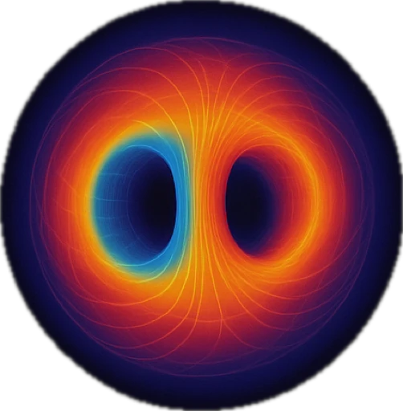

# Awesome Machine Learning in Plasma Physics 

A curated list of awesome machine learning resources for plasma physics, tokamaks, and stellarators.

## Contents

| Section | Description |
|---------|-------------|
| [Tools](#tools) | Simulation frameworks, ML toolkits, datasets, orgs |
| [Implementation Papers](#implementation-papers) | Papers with public code |
| [Research Papers](#research-papers) | Full bibliography (chronological) |
| [Contributing](#contributing) | How to add entries |

## Tools

### Simulation and Modeling Frameworks

- [TORAX](https://github.com/google-deepmind/torax) - Differentiable tokamak core transport simulator in JAX with ML-surrogate integration (QLKNN neural networks), trajectory optimization, and real-time capable compilation
- [FreeGSNKE](https://github.com/FusionComputingLab/freegsnke) - Free boundary equilibrium solver for tokamaks
- [TokaMaker](https://github.com/OpenFUSIONToolkit/OpenFUSIONToolkit) - An open-source time-dependent Grad-Shafranov tool for the design and modeling of axisymmetric fusion devices ([paper](https://arxiv.org/abs/2311.07719))
- [RAPTOR](https://crppwww.epfl.ch/~sauter/raptor/) - RApid Plasma Transport simulatOR for tokamaks
- [TGLF](https://gafusion.github.io/doc/tglf.html) - Trapped Gyro-Landau Fluid model for tokamak transport
- [FUSE.jl](https://github.com/ProjectTorreyPines/FUSE.jl) - Fusion Simulation Engine in Julia
- [MXHEquilibrium.jl](https://github.com/ProjectTorreyPines/MXHEquilibrium.jl) - MHD equilibrium solver in Julia
- [vmecpp](https://github.com/proximafusion/vmecpp) - C++ implementation of the VMEC stellarator equilibrium code
- [Raytrax](https://github.com/proximafusion/raytrax) - ECRH ray tracing for fusion plasmas in JAX with JIT compilation and automatic differentiation
- [OMFIT](https://gafusion.github.io/OMFIT-source/) - One Modeling Framework for Integrated Tasks with over 110 physics modules, supporting machine learning reduced models and HPC workflow automation. Used by 400+ scientists across 25 institutions
- [OMAS](https://gafusion.github.io/omas/) - Ordered Multi-dimensional Arrays for Magnetic Confinement Fusion, a standardized Python library for storing and manipulating tokamak experimental and simulation data
- [SIMSOPT](https://github.com/hiddenSymmetries/simsopt) - Flexible stellarator optimization framework in Python/C++ with interfaces to VMEC and SPEC, including ML-ready optimization routines and parallelized gradient calculations
- [DESC](https://github.com/PlasmaControl/DESC) - Stellarator equilibrium and optimization suite using pseudo-spectral methods and automatic differentiation
- [QuaLiKiz / QLKNN](https://gitlab.com/qualikiz-group) - Quasi-linear gyrokinetic transport model for tokamak plasmas with neural network surrogate (QLKNN) for 10,000x faster predictions
- [Travis Code](https://www.ipp.mpg.de/1060709/travis) - IPP Max Planck Institute plasma physics code
- [OpenFUSIONToolkit](https://github.com/OpenFUSIONToolkit/OpenFUSIONToolkit) - Open source fusion simulation toolkit with comprehensive plasma physics modeling capabilities
- [OpenPOPCON](https://github.com/hansec/OpenPOPCON) - Open source Plasma Operating CONtour analysis tool for tokamak performance prediction and optimization
- [CFS-POPCON](https://github.com/cfs-energy/cfspopcon) - Plasma Operating CONtour analysis tool for tokamak performance prediction and optimization
- [duqtools](https://github.com/duqtools/duqtools) - IMAS-based dynamic uncertainty quantification for tokamak simulation campaigns
- [GSFit](https://github.com/tokamak-energy/gsfit) - Grad-Shafranov Fit, a modern tokamak equilibrium reconstruction tool with a Rust solver and Python interface
- [ESSOS](https://github.com/uwplasma/ESSOS) - JAX-based e-stellarator simulation and optimization suite for stellarator coils, plasma boundaries, and magnetic-field equilibria
- [ToFu](https://github.com/ToFuProject/tofu) - IMAS-compatible Python library for synthetic diagnostics, ray tracing, and tomography for fusion devices
- [RT-GSFit](https://github.com/tokamak-energy/rtgsfit) [WIP] - Real-time Grad-Shafranov equilibrium reconstruction code deployed on ST40 and being generalized beyond device-specific workflows
- [cfsem-py](https://github.com/cfs-energy/cfsem-py) - Python/Rust quasi-steady electromagnetics toolkit covering filament models, Biot-Savart calculations, and Grad-Shafranov utilities

### Machine Learning Frameworks for Plasma Physics

- [FRNN (Fusion Recurrent Neural Network)](https://github.com/PPPLDeepLearning/plasma-python) - Deep learning package for tokamak disruption prediction using recurrent neural networks with stateful LSTM training, multi-machine capabilities, and TensorBoard integration (PPPL)
- [tglfnn-ukaea](https://github.com/ukaea/tglfnn-ukaea) - UKAEA neural network surrogate models of the TGLF quasilinear plasma turbulent transport simulator
- [VICTOR-GSC2026](https://github.com/vijaideen/VICTOR-GSC2026) [WIP] - Physics-informed neural network notebook for WEST tokamak soft X-ray tomography reconstruction using JAX/Flax
- [disruption-py](https://github.com/MIT-PSFC/disruption-py) - Physics-based scientific framework for disruption analysis with AI/ML applications supporting multi-tokamak analysis (C-Mod, DIII-D compatibility) (MIT PSFC)

### Data Platforms, Datasets & Benchmarks

- [TokSearch](https://ga-fdp.github.io/toksearch) - Search engine for fusion experimental data ([paper](https://www.sciencedirect.com/science/article/abs/pii/S0920379618301042))
- [DisruptionBench](https://github.com/MIT-PSFC/disruption-benchmark) - First standardized benchmark for tokamak disruption prediction across DIII-D, EAST, and Alcator C-Mod with ~30,000 discharges focusing on model generalizability
- [ConStellaration](https://github.com/proximafusion/constellaration) - Proxima Fusion dataset of QI-like stellarator boundaries, ideal-MHD equilibria, and optimization benchmarks ([paper](https://arxiv.org/abs/2506.19583), [dataset](https://huggingface.co/datasets/proxima-fusion/constellaration))
- [FAIR MAST](https://github.com/ukaea/fair-mast) - UKAEA data management system and public catalog infrastructure for MAST tokamak experimental data
- [OpenSTEP](https://github.com/ukaea/OpenSTEP) - UKAEA public data release for the STEP SPP-001 spherical-tokamak scenario in IMAS and NetCDF formats
- [Open Density Limit Database](https://github.com/MIT-PSFC/open_density_limit_database) - MIT PSFC public Alcator C-Mod density-limit dataset with a demo notebook for supervised ML classification
- [SPARCPublic](https://github.com/cfs-energy/SPARCPublic) - CFS public SPARC baseline physics inputs for common plasma-physics codes, including equilibria and profile files

### GitHub Discovery and Organizations

- [ITER Organization GitHub](https://github.com/iterorganization) - Official ITER GitHub organization for IMAS, plasma control, waveform, validation, and fusion-data infrastructure repositories
- [Proxima Fusion GitHub](https://github.com/proximafusion) - Proxima Fusion's open-source stellarator and fusion tooling; worth checking for new JAX, VMEC, ray-tracing, and optimization projects
- [UKAEA GitHub](https://github.com/ukaea) - UKAEA open-source fusion software and data repositories, including MAST data infrastructure, STEP scenario releases, and tokamak systems tools
- [MIT PSFC GitHub](https://github.com/MIT-PSFC) - MIT Plasma Science and Fusion Center repositories for disruption analysis, open datasets, SPARC/Alcator C-Mod tooling, and ML working-group materials
- [CFS Energy GitHub](https://github.com/cfs-energy) - Commonwealth Fusion Systems public repositories for SPARC physics inputs, POPCON analysis, electromagnetics, and scientific-software utilities
- [Nuclear Fusion Open Source projects](https://github.com/kripnerl/fusion-open-source) - Community-maintained discovery list of open-source magnetic-fusion projects

## Implementation Papers

Papers with publicly available code implementations:

- **Physics-informed deep learning model for line-integral diagnostics across fusion devices** - *Wang et al. (2025)* - [Paper](https://doi.org/10.1088/1741-4326/ade0ce) | [Code](https://github.com/calledice/onion) - Neural network model for cross-device line-integral diagnostics with physics constraints

## Research Papers

*Papers are organized chronologically (newest first)*

**Format:** "**title** - **year** - *authors* - journal/conference/thesis - link - abstract or summary"

**A Data-Free, Physics-Informed Surrogate Solver for Drift Kinetic Equation: Enabling Fast Neoclassical Toroidal Viscosity Torque Modeling in Tokamaks** - **2026** - *Xingting Yan, Y. Meng, Nana Bao, Youwen Sun, Weiyong Zhou, Jinpeng Huang* - journal - [arXiv](https://arxiv.org/abs/2604.13447) - Toroidal rotation is crucial for maintaining stable and high performance plasmas in tokamak fusion reactors. Among its driving mechanisms, the neoclassical toroidal viscosity (NTV) torque--induced by three-dimensional magnetic perturbations--is particularly significant due to its strong impact and controllability, especially for reactor-scale devices like ITER where conventional momentum injection method becomes less effective. However, traditional first-principle NTV modeling is computationa... <!-- imported-from-bib -->

**A Novel Numerical Algorithms Optimization Method with Machine Learning Frameworks: Application on Real-time Plasmas Equilibrium Reconstruction in EXL-50U Spherical Torus** - **2026** - *G. Zheng, S. Liu, X. Gu, Y. Zhang, J. Li, Y. Liu, X. Lun, L. Xing, J. Chen, Z. Y. Chen, Y. Yu, D. Guo, Z. Yang, H. Xie, X. Song, Y. Shi, EXL-50 Team* - journal - [arXiv](https://arxiv.org/abs/2601.12378) - This work proposes for the first time a novel optimization method for numerical algorithms, which takes advantages of machine learning frameworks PyTorch and TensorRT, leveraging their modularity, low development threshold, and automatic tuning characteristics to achieve a real-time plasmas reconstruction algorithm called PTEFIT as an application in tokamak-based controlled fusion that combines performance, flexibility, and usability. The algorithm has been deployed and routinely operated on ... <!-- imported-from-bib -->

**A Physics-Informed Neural Network for Solving the Quasi-static Magnetohydrodynamic Equations** - **2026** - *Jonathan S. Arnaud, Christopher J. McDevitt, G. Wimmer, Xianhua Tang* - journal - [arXiv](https://arxiv.org/abs/2604.20085) - A physics-informed neural network (PINN) is developed, for the first time, to learn the time-dependent quasi-static magnetohydrodynamic (MHD) equations in axisymmetric tokamak geometry, without any experimental or synthetic data. The initial study considered an ITER-like tokamak and found that a PINN, after careful treatment, was capable of learning the solution to the MHD system and predict a vertically displacing plasma, where general agreement with ground truth simulation was observed. The... <!-- imported-from-bib -->

**An improved plasma boundary detection based on an optimized U-Net deep learning network for Tokamak devices** - **2026** - *S. Shu, Xiuqi Jiang, Meixia Chen, Xianli Lang, Jiarong Luo* - journal - [DOI](https://doi.org/10.1088/1748-0221/21/01/P01007) - Tokamak is a typical nuclear fusion device, where effective control of the plasma boundary contributes to its long-pulse stable operation. Nowadays, CCD camera diagnostic systems are widely used in most fusion devices. By detecting the CCD images of plasma discharge, the plasma boundary can be obtained. The U-Net deep learning network, with its excellent feature extraction and boundary perception capabilities, possesses excellent image detection characteristics and can be applied in boundary ... <!-- imported-from-bib -->

**Data-driven prediction of the L--H transition power threshold in the EAST tokamak using ensemble learning regression** - **2026** - *wanli lyu, hui wang, Ping Wang, Xin Lin, Dengdi Sun, Xiao Wang, Zhen Deng, L. Shao, Qingquan Yang, Jin Tang, Guosheng Xu* - journal - [DOI](https://doi.org/10.1088/1361-6587/ae533c) - Accurate prediction of the L–H transition power threshold is essential for achieving steady-state high-performance burning plasmas in future fusion reactors. In this study, we develop a machine learning–based regression framework to predict the plasma power loss across the separatrix, Ploss, at the onset of the L–H transition. The model is trained on 3308 EAST discharges; from each discharge, we extract exactly one sample at the onset of its first L–H transition. Three ensemble learning model... <!-- imported-from-bib -->

**Deep-Learning based surrogate models for plasma exhaust simulations -- SOLPS-NN** - **2026** - *Stefan Dasbach, S. Brezinsek, Yunfeng Liang, Dirk Reiser, S. Wiesen* - journal - [arXiv](https://arxiv.org/abs/2604.19223) - Accurate models of the scrape-off layer are required for the design and operation of tokamak fusion reactors. Scrape-off layer simulations are computationally expensive, difficult to operate and suffer from numerical instabilities. A potential remedy comes in using machine learning models trained on simulations for fast and easy to use predictions. We present a such candidate surrogate model - named SOLPS-NN - to provide recommendations for the methods to construct it. Based on a large datase... <!-- imported-from-bib -->

**Demonstration of reconstruction-free static magnetic control of DIII-D plasma with deep reinforcement learning** - **2026** - *Georgy Subbotin, D. Sorokin, M. Nurgaliev, A. Granovskiy, I. Kharitonov, E. Adishchev, Eduard Khairutdinov, Randall Clark, Heather Shen, W. Choi, J. Barr, D. M. Orlov* - journal - [arXiv](https://arxiv.org/abs/2506.13267) | [DOI](https://doi.org/10.1088/1741-4326/ae34c6) - This paper presents the development and experimental validation of a reinforcement learning (RL)-based magnetic controller on the DIII-D tokamak. The controller directly maps raw magnetic diagnostic signals to actuator commands, replacing the traditional isoflux control algorithm based on equilibrium reconstruction. Four RL controllers are trained using the Soft Actor–Critic algorithm with an asymmetric Actor–Critic architecture in the NSFsim simulator. All controllers are deployed in the DII... <!-- imported-from-bib -->

**Efficient and accurate AI-forecasting of magnetic probe signals in tokamak** - **2026** - *Ruijie Yin, Wei Zhang, Baofeng Gao, Zhangyong Liang, Xiaofei Zhao* - journal - [DOI](https://doi.org/10.1088/2058-6272/ae60e8) - Tearing modes (TMs) are detrimental magnetohydrodynamic instabilities in tokamaks that degrade plasma confinement and obstruct fusion. Traditional approaches, including theoretical analysis, numerical simulations, and experimental diagnostics, face challenges in accuracy, cost, or forecasting time length. In this study, we develop a toolbox called Magnetic Probe Prediction, which leverages deep learning algorithms for time-series to process magnetic probe data from experimental diagnostics fo... <!-- imported-from-bib -->

**FPGA-Accelerated Real-Time Diagnostics at DIII-D Using the SLAC Neural Network Library for ML Inference** - **2026** - *Abhilasha Dave, Semin Joung, Sangkyeun Kim, Ramon Reed, Keith Erickson, J. Butt, A. Jalalvand, Mudit Mishra, James Russell, Larry Ruckman, Ryan Herbst, E. Kolemen, David Smith, Ryan N Coffee* - journal - [arXiv](https://arxiv.org/abs/2604.26042) - In this work, we demonstrate the deployment of a hardware-accelerated machine learning (ML) inference system integrated into a real-time processing at the DIII-D tokamak fusion reactor. The team has successfully deployed an AMD/Xilinx KCU1500 field-programmable gate array (FPGA) into the realtime Plasma Control System (PCS) nodes that receives the live Beam Emission Spectroscopy (BES) signal used for Edge Localized Mode (ELM) forecasting. The FPGA hosts a dense neural network using the SLAC N... <!-- imported-from-bib -->

**Machine learning prediction of plasma behavior from discharge configurations on WEST** - **2026** - *Chenguang Wan, F. Almuhisen, Philippe Moreau, R. Nouailletas, Z. Qu, Youngwoo Cho, R. Varennes, Kyungtak Lim, Kunpeng Li, J. Huang, Weidong Chen, Jiangang Li, X. Garbet, West team* - journal - [arXiv](https://arxiv.org/abs/2602.19110) | [DOI](https://doi.org/10.1088/1741-4326/ae4917) - Accurately predicting plasma behavior based on discharge configurations is essential for the safe and efficient operation of tokamak experiments. While physics-based integrated modeling codes provide valuable insights, their high computational cost limits their applicability for fast scenario design and control optimization. In this study, we propose a transformer-based machine learning model to predict key global plasma parameters on the Tungsten (W) Environment in Steady-State Tokamak (WEST... <!-- imported-from-bib -->

**Multi-diagnostics reconstruction of magnetic equilibrium and kinetic profiles using physics-informed neural networks with applications to JET** - **2026** - *N. Rutigliano, A. Murari, P. Gaudio, M. Gelfusa, R. Rossi* - journal - [DOI](https://doi.org/10.1088/1741-4326/ae4916) - Physics-informed neural networks (PINNs) are deep learning neural networks explicitly conceived as an alternative solver of partial differential equations with respect to standard numerical techniques. PINNs offer some unique features, such as the capability of constraining the solution with internal or external and local or integral information, allowing to take into account uncertainty of this information. They can also be constrained with incomplete physics equations, allowing the developm... <!-- imported-from-bib -->

**Offline Reinforcement Learning for Rotation Profile Control in Tokamaks** - **2026** - *Rohit Sonker, H. Kaga, Jiayu Chen, Andrew Rothstein, I. Char, R. Shousha, E. Kolemen, Jeff Schneider* - journal - [arXiv](https://arxiv.org/abs/2605.05857) - Tokamaks remain leading candidates for achieving practical fusion energy, yet many important control problems inside these devices are still difficult or unsolved. One such challenge is controlling the plasma rotation profile, which strongly influences stability, confinement, and transport. While the average rotation can be controlled, controlling the full profile is challenging due to high dimensionality, response to multiple actuators and dependence on plasma condition. Learning-based contr... <!-- imported-from-bib -->

**Optimisation of physics-informed neural network architecture and training for tokamak equilibrium reconstruction** - **2026** - *N. Rutigliano, A. Murari, P. Gaudio, M. Gelfusa, R. Rossi* - journal - [DOI](https://doi.org/10.1088/1361-6587/ae54c9) - Reconstructing the plasma state is a central challenge in nuclear fusion experiments, as it is essential for understanding and predicting plasma behaviour. Physics-informed neural networks (PINNs), especially when combined with a multi-diagnostic approach, offer powerful advantages for addressing this problem. PINNs embed the governing physical laws directly into the learning process through differential equation constraints, enabling them to integrate sparse or noisy measurements while maint... <!-- imported-from-bib -->

**Prediction of the Linear Growth Rate of Tokamak Sawtooth Mode Based on Machine Learning and Physical Models** - **2026** - *Peijie Zhang, Hongwei Ning, Jinhong Yang, Z. Ren, Sheng Liu, Jun Kuang, Yiqing Wang, Weihua Wang* - journal - [DOI](https://doi.org/10.1007/s10894-025-00543-x) - This paper builds upon previous numerical simulations of the sawtooth mode instability physical model (CLT) to construct a database containing plasma configurations and their corresponding sawtooth mode growth rates, and trains three machine learning methods to rapidly predict the growth rates of sawtooth mode for plasma configurations across a wide parameter domain. <!-- imported-from-bib -->

**Real-time data cleaning method for multi-channel diagnostic systems based on machine learning on EAST tokamak** - **2026** - *Lifeng Yang, Ting Lan, Shouxin Wang, Yao Zhang, Haiqing Liu, Yinxian Jie* - journal - [DOI](https://doi.org/10.1088/1361-6587/ae3857) - Ensuring the reliability of plasma diagnostic data is essential for both safe operation and accurate analysis in Magnetic confinement fusion (MCF) devices. However, diagnostic signals are often corrupted by electromagnetic interference, hardware faults, or neutron irradiation, resulting in erroneous diagnostic data. To address this issue, a novel Real-Time Time-Domain Global Similarity (RT-TDGS) method based on machine learning is proposed. RT-TDGS transforms the multi-label classification pr... <!-- imported-from-bib -->

**Reconstruction of poloidal magnetic fluxes on EAST based on neural networks with edge electromagnetic diagnostics** - **2026** - *Xiangze Xia, F. Long, Jian Liu, Zixi Liu, Xiaodong Wu, Chenguang Wan, Xiaohe Wu, Xiang Gao, Guoqiang Li, Zhengping Luo, Jinping Qian* - journal - [DOI](https://doi.org/10.1088/2058-6272/ae587a) - Accurate reconstruction of tokamak equilibria requires precise measurements of magnetic fields and magnetic flux, which is essential for effective plasma control and optimization. To reconstruct equilibria, code like equilibrium fitting code (EFIT) solves the nonlinear Grad–Shafranov equation. This depends on the traditional algorithms achieved by iteratively minimizing the discrepancy between predicted and measured edge electromagnetic diagnostic signals. The iterative methods face high comp... <!-- imported-from-bib -->

**A generative artificial intelligence framework for long-time plasma turbulence simulations** - **2025** - *Clavier, B, Zarzoso, D, del-Castillo-Negrete, D, Fr\'{e}nod, E* - journal - [DOI](https://doi.org/10.1063/5.0255386) - Generative deep learning techniques are employed in a novel framework for the construction of surrogate models capturing the spatiotemporal dynamics of 2D plasma turbulence. The proposed Generative Artificial Intelligence Turbulence (GAIT) framework enables the acceleration of turbulence simulations for long-time transport studies. GAIT leverages a convolutional variational auto-encoder and a recurrent neural network to generate new turbulence data from existing simulations, extending the tim... <!-- imported-from-bib -->

**Active ramp-down control and trajectory design for tokamaks with neural differential equations and reinforcement learning** - **2025** - *Wang, Allen M, Rea, Cristina, So, Oswin, Dawson, Charles, Garnier, Darren T, Fan, Chuchu* - journal - [DOI](https://doi.org/10.1038/s42005-025-02146-6) - The tokamak offers a promising path to fusion energy, but disruptions pose a major economic risk, motivating solutions to manage their consequence. This work develops a reinforcement learning approach to this problem by training a policy to ramp-down the plasma current while avoiding limits on a number of quantities correlated with disruptions. The policy training environment is a hybrid physics and machine learning model trained on simulations of the SPARC primary reference discharge (PRD) r... <!-- imported-from-bib -->

**CARONTE: a Physics-Informed Extreme Learning Machine-Based Algorithm for Plasma Boundary Reconstruction in Magnetically Confined Fusion Devices** - **2025** - *F. Fiorenza, S. Dubbioso, G. Tommasi, A. Pironti* - journal - [arXiv](https://arxiv.org/abs/2512.16689) - In this work, we propose a novel physics informed neural network based algorithm for real time plasma boundary reconstruction in tokamak devices. The approach is based on a single Extreme Learning Machine network used to solve the homogeneous Grad Shafranov equation, which is required to identify the plasma boundary. This architecture enables the real time training of the network parameters using the available magnetic sensor data and, consequently, dynamically adapting the network output to ... <!-- imported-from-bib -->

**Combining physics-based and data-driven models for quantitatively accurate plasma profile prediction that extrapolates well; with application to DIII-D, AUG, and ITER tokamaks** - **2025** - *J. Abbate, E. Fable, G. Tardini, Rainer Fischer, E. Kolemen* - journal - [DOI](https://doi.org/10.1088/1741-4326/adc283) - For design, scenario planning, and control, ITER and all other envisioned tokamaks rely on a variety of statistical and physics-based models to extrapolate to unseen regimes; most notably from low plasma current to high. A ‘meta-learning’ methodology for combining the accuracy of data-driven models with the generalizability of physics-based models is described and tested, yielding a 5–10 percent improvement in performance beyond either alone for the task of extrapolating time-dependent plasma... <!-- imported-from-bib -->

**DisruptionBench and Complimentary New Models: Two Advancements in Machine Learning Driven Disruption Prediction** - **2025** - *Spangher, L, Bonotto, M, Arnold, William, Chayapathy, Dhruva, Gallingani, Tommaso, others* - journal - [DOI](https://doi.org/10.1007/s10894-025-00495-2) - A transformer-based model inspired by GPT-2, capable of learning long-range temporal dependencies through self-attention, and a Continuous Convolutional Neural Network that leverages continuous kernels to capture subtle variations in plasma signals are proposed. <!-- imported-from-bib -->

**Enabling Integrated AI Control on DIII-D: A Control System Design with State-of-the-art Experiments** - **2025** - *Andrew Rothstein, H. Kaga, J. Butt, R. Shousha, K. Erickson, T. Wakatsuki, A. Jalalvand, Peter Steiner, Sangkyeun Kim, E. Kolemen* - journal - [arXiv](https://arxiv.org/abs/2511.08818) | [DOI](https://doi.org/10.48550/arXiv.2511.08818) - We present the design and application of a general algorithm for Prediction And Control using MAchiNe learning (PACMAN) in DIII-D. Machine learing (ML)-based predictors and controllers have shown great promise in achieving regimes in which traditional controllers fail, such as tearing mode free scenarios, ELM-free scenarios and stable advanced tokamak conditions. The architecture presented here was deployed on DIII-D to facilitate the end-to-end implementation of advanced control experiments,... <!-- imported-from-bib -->

**How does ion temperature gradient turbulence depend on magnetic geometry? Insights from data and machine learning** - **2025** - *M. Landreman, Jong Youl Choi, C. Alves, Prasanna Balaprakash, M. Churchill, R. Conlin, G. Roberg-Clark* - journal - [arXiv](https://arxiv.org/abs/2502.11657) | [DOI](https://doi.org/10.1017/S0022377825100536) - Magnetic geometry has a significant effect on the level of turbulent transport in fusion plasmas. Here, we model and analyse this dependence using multiple machine learning methods and a dataset of ${\gt}200\,000$ nonlinear gyrokinetic simulations of ion-temperature-gradient turbulence in diverse non-axisymmetric geometries. The dataset is generated using a large collection of both optimised and randomly generated stellarator equilibria. At fixed gradients and other input parameters, the turb... <!-- imported-from-bib -->

**Impact of model uncertainty on SPARC operating scenario predictions with empirical modeling** - **2025** - *Saltzman, A, Rodriguez-Fernandez, P, Body, T, Ho, A, Howard, N T* - journal - [arXiv](https://arxiv.org/abs/2506.09879) - Understanding and accounting for uncertainty helps to ensure next-step tokamaks such as SPARC will robustly achieve their goals. While traditional Plasma OPerating CONtour (POPCON) analyses guide design, they often overlook the significant impact of uncertainties in scaling laws, plasma profiles, and impurity concentrations on performance predictions. This work confronts these challenges by introducing statistical POPCONs, which leverage Monte Carlo analysis to quantify the sensitivity of SPA... <!-- imported-from-bib -->

**Introduction and development of machine learning models for LIBS for thermonuclear fusion** - **2025** - *P. Gąsior, D. Sokulski* - journal - [DOI](https://doi.org/10.1088/1361-6587/add620) - Due to its potential in contactless and non-interfering diagnostics, laser-induced breakdown spectroscopy (LIBS) has become an important element of research in the PWI (plasma wall interactions) area, which has been under the intensive inves

... [OUTPUT TRUNCATED - 23939 chars omitted out of 73939 total] ...

ort, and current diffusion, incorporating modular physics-based and ML models. JAX's just-in-time compilation ensures fast runtimes, while its automatic differentiation capability enables gradient-based optimization workflows and simplifies the use of Jacobian-base... <!-- imported-from-bib -->

**Time series viewmakers for robust disruption prediction** - **2024** - *Chayapathy, Dhruva, Siebert, Tavis, Spangher, Lucas, Moharir, Akshata Kishore, Patil, Om Manoj, Rea, Cristina* - journal - [arXiv](https://arxiv.org/abs/2410.11065) - Machine Learning guided data augmentation may support the development of technologies in the physical sciences, such as nuclear fusion tokamaks. Here we endeavor to study the problem of detecting disruptions i.e. plasma instabilities that can cause significant damages, impairing the reliability and efficiency required for their real world viability. Machine learning (ML) prediction models have shown promise in detecting disruptions for specific tokamaks, but they often struggle in generalizin... <!-- imported-from-bib -->

**Tokamak edge localized mode onset prediction with deep neural network and pedestal turbulence** - **2024** - *Joung, Semin, Smith, David R, McKee, G, Yan, Z, Gill, K, Zimmerman, J, Geiger, B, Coffee, R, O'Shea, F H, Jalalvand, A, Kolemen, E* - journal - [DOI](https://doi.org/10.1088/1741-4326/ad43fb) - Abstract A neural network, BES-ELMnet, predicting a quasi-periodic disruptive eruption of the plasma energy and particles known as edge localized mode (ELM) onset is developed with observed pedestal turbulence from the beam emission spectroscopy system in DIII-D. BES-ELMnet has convolutional and fully-connected layers, taking two-dimensional plasma fluctuations with a temporal window of size 128 $\mathrm{\mu}$s and generating a scalar output which can be interpreted as a probability of the up... <!-- imported-from-bib -->

**Automatic identification of edge localized modes in the DIII-D tokamak** - **2023** - *O'Shea, Finn H, Joung, Semin, Smith, David R, Coffee, Ryan* - journal - [DOI](https://doi.org/10.1063/5.0134001) - Fusion power production in tokamaks uses discharge configurations that risk producing strong type I edge localized modes. The largest of these modes will likely increase impurities in the plasma and potentially damage plasma facing components, such as the protective heat and particle divertor. Machine learning-based prediction and control may provide for the automatic detection and mitigation of these damaging modes before they grow too large to suppress. To that end, large labeled datasets a... <!-- imported-from-bib -->

**Autoregressive transformers for disruption prediction in nuclear fusion plasmas** - **2023** - *Spangher, Lucas, Arnold, William, Spangher, Alexander, Maris, Andrew, Rea, Cristina* - journal - [arXiv](https://arxiv.org/abs/2401.00051) - The physical sciences require models tailored to specific nuances of different dynamics. In this work, we study outcome predictions in nuclear fusion tokamaks, where a major challenge are \textit{disruptions}, or the loss of plasma stability with damaging implications for the tokamak. Although disruptions are difficult to model using physical simulations, machine learning (ML) models have shown promise in predicting these phenomena. Here, we first study several variations on masked autoregres... <!-- imported-from-bib -->

**Bayesian optimization of massive material injection for disruption mitigation in tokamaks** - **2023** - *Pusztai, I, Ekmark, I, Bergstr{\"{o}}m, H, Halldestam, P, Jansson, P, Hoppe, M, Vallhagen, O, F{\"{u}}l{\"{o}}p, T* - journal - [DOI](https://doi.org/10.1017/s0022377823000193) - A Bayesian optimization framework is used to investigate scenarios for disruptions mitigated with combined deuterium and neon injection in ITER. The optimization cost function takes into account limits on the maximum runaway current, the transported fraction of the heat loss and the current quench time. The aim is to explore the dependence of the cost function on injected densities, and provide insights into the behaviour of the disruption dynamics for representative scenarios. The simulation... <!-- imported-from-bib -->

**Continuous Convolutional Neural Networks for disruption prediction in nuclear fusion plasmas** - **2023** - *Arnold, William F, Spangher, Lucas, Rea, Christina* - journal - [arXiv](https://arxiv.org/abs/2312.01286) - Grid decarbonization for climate change requires dispatchable carbon-free energy like nuclear fusion. The tokamak concept offers a promising path for fusion, but one of the foremost challenges in implementation is the occurrence of energetic plasma disruptions. In this study, we delve into Machine Learning approaches to predict plasma state outcomes. Our contributions are twofold: (1) We present a novel application of Continuous Convolutional Neural Networks for disruption prediction and (2) ... <!-- imported-from-bib -->

**Disruption prediction for future tokamaks using parameter-based transfer learning** - **2023** - *Zheng, Wei, Xue, Fengming, Chen, Zhongyong, Chen, Dalong, Guo, Bihao, Shen, Chengshuo, Ai, Xinkun, Wang, Nengchao, Zhang, Ming, Ding, Yonghua, Chen, Zhipeng, Yang, Zhoujun, Shen, Biao, Xiao, Bingjia, Pan, Yuan* - journal - [DOI](https://doi.org/10.1038/s42005-023-01296-9) - AbstractTokamaks are the most promising way for nuclear fusion reactors. Disruption in tokamaks is a violent event that terminates a confined plasma and causes unacceptable damage to the device. Machine learning models have been widely used to predict incoming disruptions. However, future reactors, with much higher stored energy, cannot provide enough unmitigated disruption data at high performance to train the predictor before damaging themselves. Here we apply a deep parameter-based transfe... <!-- imported-from-bib -->

**Fast equilibrium reconstruction by deep learning on EAST tokamak** - **2023** - *Lu, Jingjing, Hu, Youjun, Xiang, Nong, Sun, Youwen* - journal - [DOI](https://doi.org/10.1063/5.0152318) - A deep neural network is developed and trained on magnetic measurements (input) and EFIT poloidal magnetic flux (output) on the EAST tokamak. In optimizing the network architecture, we use automatic optimization to search for the best hyperparameters, which helps in better model generalization. We compare the inner magnetic surfaces and last-closed-flux surfaces with those from EFIT. We also calculated the normalized internal inductance, which is completely determined by the poloidal magnetic... <!-- imported-from-bib -->

**Fourier Neural Operator for Plasma Modelling** - **2023** - *Gopakumar, Vignesh, Pamela, Stanislas, Zanisi, Lorenzo, Li, Zongyi, Anandkumar, Anima, MAST Team* - journal - [arXiv](https://arxiv.org/abs/2302.06542) - Predicting plasma evolution within a Tokamak is crucial to building a sustainable fusion reactor. Whether in the simulation space or within the experimental domain, the capability to forecast the spatio-temporal evolution of plasma field variables rapidly and accurately could improve active control methods on current tokamak devices and future fusion reactors. In this work, we demonstrate the utility of using Fourier Neural Operator (FNO) to model the plasma evolution in simulations and exper... <!-- imported-from-bib -->

**GS-DeepNet: mastering tokamak plasma equilibria with deep neural networks and the Grad-Shafranov equation** - **2023** - *Joung, Semin, Ghim, Y-C, Kim, Jaewook, Kwak, Sehyun, Kwon, Daeho, Sung, C, Kim, D, Kim, Hyun-Seok, Bak, J G, Yoon, S W* - journal - [DOI](https://doi.org/10.1038/s41598-023-42991-5) - The force-balanced state of magnetically confined plasmas heated up to 100 million degrees Celsius must be sustained long enough to achieve a burning-plasma state, such as in the case of ITER, a fusion reactor that promises a net energy gain. This force balance between the Lorentz force and the pressure gradient force, known as a plasma equilibrium, can be theoretically portrayed together with Maxwell's equations as plasmas are collections of charged particles. Nevertheless, identifying the p... <!-- imported-from-bib -->

**Grad-Shafranov equilibria via data-free physics informed neural networks** - **2023** - *Jang, Byoungchan, Kaptanoglu, Alan A, Gaur, Rahul, Pan, Shaw, Landreman, Matt, Dorland, William* - journal - [arXiv](https://arxiv.org/abs/2311.13491) - A large number of magnetohydrodynamic (MHD) equilibrium calculations are often required for uncertainty quantification, optimization, and real-time diagnostic information, making MHD equilibrium codes vital to the field of plasma physics. In this paper, we explore a method for solving the Grad-Shafranov equation by using Physics-Informed Neural Networks (PINNs). For PINNs, we optimize neural networks by directly minimizing the residual of the PDE as a loss function. We show that PINNs can acc... <!-- imported-from-bib -->

**Hybridizing physics and neural ODEs for predicting plasma inductance dynamics in tokamak fusion reactors** - **2023** - *Wang, Allen M, Garnier, Darren T, Rea, Cristina* - journal - [arXiv](https://arxiv.org/abs/2310.20079) - While fusion reactors known as tokamaks hold promise as a firm energy source, advances in plasma control, and handling of events where control of plasmas is lost, are needed for them to be economical. A significant bottleneck towards applying more advanced control algorithms is the need for better plasma simulation, where both physics-based and data-driven approaches currently fall short. The former is bottle-necked by both computational cost and the difficulty of modelling plasmas, and the l... <!-- imported-from-bib -->

**Machine learning and Bayesian inference in nuclear fusion research: an overview** - **2023** - *Pavone, A, Merlo, A, Kwak, S, Svensson, J* - journal - [DOI](https://doi.org/10.1088/1361-6587/acc60f) - Abstract This article reviews applications of Bayesian inference and machine learning (ML) in nuclear fusion research. Current and next-generation nuclear fusion experiments require analysis and modelling efforts that integrate different models consistently and exploit information found across heterogeneous data sources in an efficient manner. Model-based Bayesian inference provides a framework well suited for the interpretation of observed data given physics and probabilistic assumptions, al... <!-- imported-from-bib -->

**Multi-fidelity neural network representation of gyrokinetic turbulence** - **2023** - *Neiser, Tom, Meneghini, Orso, Smith, Sterling, McClenaghan, Joseph, Slendebroek, Tim, Orozco, David, Sammuli, Brian, Staebler, Gary, Hall, Joseph, Belli, Emily, Candy, Jeff* - journal - [Link](https://ui.adsabs.harvard.edu/abs/2023APS..DPPPP1039N/abstract) - This presentation will introduce a multi-fidelity neural network model of gyrokinetic turbulence GKNN-0, which has been trained and validated against a database of 5 million TGLF simulations and 5000 linear CGYRO simulations with experimental input parameters from the DIII-D tokamak. The first half of the presentation will review the TGLF saturation rules-SAT0, SAT1, SAT2-and present a big data approach to validating both the linear model of TGLF and the saturation rules using experimental da... <!-- imported-from-bib -->

**Physics-preserving AI-accelerated simulations of plasma turbulence** - **2023** - *Greif, Robin, Jenko, Frank, Thuerey, Nils* - journal - [arXiv](https://arxiv.org/abs/2309.16400) - Turbulence in fluids, gases, and plasmas remains an open problem of both practical and fundamental importance. Its irreducible complexity usually cannot be tackled computationally in a brute-force style. Here, we combine Large Eddy Simulation (LES) techniques with Machine Learning (ML) to retain only the largest dynamics explicitly, while small-scale dynamics are described by an ML-based sub-grid-scale model. Applying this novel approach to self-driven plasma turbulence allows us to remove la... <!-- imported-from-bib -->

**TokaMaker: An open-source time-dependent Grad-Shafranov tool for the design and modeling of axisymmetric fusion devices** - **2023** - *Hansen, C, Stewart, I G, Burgess, D, Pharr, M, Guizzo, S, Logak, F, Nelson, A O, Paz-Soldan, C* - journal - [arXiv](https://arxiv.org/abs/2311.07719) | [DOI](https://doi.org/10.1016/j.cpc.2024.109111) - In this paper, we present a new static and time-dependent MagnetoHydroDynamic (MHD) equilibrium code, TokaMaker, for axisymmetric configurations of magnetized plasmas, based on the well-known Grad-Shafranov equation. This code utilizes finite element methods on an unstructured triangular grid to enable capturing accurate machine geometry and simple mesh generation from engineering-like descriptions of present and future devices. The new code is designed for ease of use without sacrificing cap... <!-- imported-from-bib -->

**Towards practical reinforcement learning for tokamak magnetic control** - **2023** - *Tracey, Brendan D, Michi, Andrea, Chervonyi, Yuri, Davies, Ian, Paduraru, Cosmin, Lazic, Nevena, Felici, Federico, Ewalds, Timo, Donner, Craig, Galperti, Cristian, Buchli, Jonas, Neunert, Michael, Huber, Andrea, Evens, Jonathan, Kurylowicz, Paula, Mankowitz, Daniel J, Riedmiller, Martin, The TCV Team* - journal - [arXiv](https://arxiv.org/abs/2307.11546) - Reinforcement learning (RL) has shown promising results for real-time control systems, including the domain of plasma magnetic control. However, there are still significant drawbacks compared to traditional feedback control approaches for magnetic confinement. In this work, we address key drawbacks of the RL method; achieving higher control accuracy for desired plasma properties, reducing the steady-state error, and decreasing the required time to learn new tasks. We build on top of \cite{deg... <!-- imported-from-bib -->

**Building database of 2D UEDGE simulations for the development of a surrogate model of divertor detachment control** - **2022** - *Zhao, Menglong, Rognlien, Thomas, Zhu, Ben, Meyer, William, Xu, Xueqiao, Bhatia, Harsh, Li, Nami, Bremer, Peer-Timo* - journal - [Link](https://ui.adsabs.harvard.edu/abs/2022APS..DPPUP1057Z/abstract) - A large set of 2D UEDGE simulations with currents and cross-field drifts based on a generic medium-size tokamak geometry are obtained for the development of machine learning surrogate models for detachment control. For the current 2D data set, three control parameters are varied: gas puff rate, power input and impurity fraction. In addition, the values of the perpendicular anomalous transport coefficients are scanned because they are the most important uncertainty input of UEDGE or other 2D t... <!-- imported-from-bib -->

**Data-driven model for divertor plasma detachment prediction** - **2022** - *Zhu, Ben, Zhao, Menglong, Bhatia, Harsh, Xu, Xue-Qiao, Bremer, Peer-Timo, Meyer, William, Li, Nami, Rognlien, Thomas* - journal - [arXiv](https://arxiv.org/abs/2206.09964) | [DOI](https://doi.org/10.1017/S002237782200085X) | [Link](https://www.cambridge.org/core/product/identifier/S002237782200085X/type/journal_article) - We present a fast and accurate data-driven surrogate model for divertor plasma detachment prediction leveraging the latent feature space concept in machine learning research. Our approach involves constructing and training two neural networks. An autoencoder that finds a proper latent space representation (LSR) of plasma state by compressing the multi-modal diagnostic measurements, and a forward model using multi-layer perception (MLP) that projects a set of plasma control parameters to its c... <!-- imported-from-bib -->

**Estimation of the electron temperature profile in tokamaks using analytical and neural network models** - **2022** - *Morosohk, Shira, Pajares, Andres, Schuster, Eugenio* - conference - [DOI](https://doi.org/10.23919/acc53348.2022.9867844) - Generating energy from nuclear fusion in a tokamak may highly benefit from precise control of both kinetic and magnetic spatially-varying properties of the plasma (hot ionized gas where the fusion reactions take place). The spatial dependence of a plasma property, from the core to the edge of the plasma, is referred to as profile. Many control algorithms being developed require accurate, real-time knowledge of the plasma space-dependent state. However, many of the diagnostics used to measure ... <!-- imported-from-bib -->

**Magnetic control of tokamak plasmas through deep reinforcement learning** - **2022** - *Degrave, Jonas, Felici, Federico, Buchli, Jonas, Neunert, Michael, Tracey, Brendan, Carpanese, Francesco, Ewalds, Timo, Hafner, Roland, Abdolmaleki, Abbas, de Las Casas, Diego, Donner, Craig, Fritz, Leslie, Galperti, Cristian, Huber, Andrea, Keeling, James, Tsimpoukelli, Maria, Kay, Jackie, Merle, Antoine, Moret, Jean-Marc, Noury, Seb, Pesamosca, Federico, Pfau, David, Sauter, Olivier, Sommariva, Cristian, Coda, Stefano, Duval, Basil, Fasoli, Ambrogio, Kohli, Pushmeet, Kavukcuoglu, Koray, Hassabis, Demis, Riedmiller, Martin* - journal - [DOI](https://doi.org/10.1038/s41586-021-04301-9) - AbstractNuclear fusion using magnetic confinement, in particular in the tokamak configuration, is a promising path towards sustainable energy. A core challenge is to shape and maintain a high-temperature plasma within the tokamak vessel. This requires high-dimensional, high-frequency, closed-loop control using magnetic actuator coils, further complicated by the diverse requirements across a wide range of plasma configurations. In this work, we introduce a previously undescribed architecture f... <!-- imported-from-bib -->

**Neural net modeling of equilibria in NSTX-U** - **2022** - *Wai, J T, Boyer, M D, Kolemen, E* - journal - [arXiv](https://arxiv.org/abs/2202.13915) - Neural networks (NNs) offer a path towards synthesizing and interpreting data on faster timescales than traditional physics-informed computational models. In this work we develop two neural networks relevant to equilibrium and shape control modeling, which are part of a suite of tools being developed for the National Spherical Torus Experiment-Upgrade (NSTX-U) for fast prediction, optimization, and visualization of plasma scenarios. The networks include Eqnet, a free-boundary equilibrium solv... <!-- imported-from-bib -->

**Normalizing flows for likelihood-free inference with fusion simulations** - **2022** - *Furia, C S, Churchill, R M* - journal - [DOI](https://doi.org/10.1088/1361-6587/ac828d) - AbstractFluid-based scrape-off layer transport codes, such as UEDGE, are heavily utilized in tokamak analysis and design, but typically require user-specified anomalous transport coefficients to match experiments. Determining the uniqueness of these parameters and the uncertainties in them to match experiments can provide valuable insights to fusion scientists. We leverage recent work in the area of likelihood-free inference (`simulation-based inference') to train a neural network, which enab... <!-- imported-from-bib -->

**Physics-informed machine learning techniques for edge plasma turbulence modelling in computational theory and experiment** - **2022** - *Mathews, Abhilash* - journal - [arXiv](https://arxiv.org/abs/2205.07838) - Edge plasma turbulence is critical to the performance of magnetic confinement fusion devices. Towards better understanding edge turbulence in both theory and experiment, a custom-built physics-informed deep learning framework constrained by partial differential equations is developed to accurately learn turbulent fields consistent with the two-fluid theory from partial observations of electron pressure. This calculation is not otherwise possible using conventional equilibrium models. With thi... <!-- imported-from-bib -->

**Transferable cross-tokamak disruption prediction with deep hybrid neural network feature extractor** - **2022** - *Zheng, Wei, Xue, Fengming, Zhang, Ming, Chen, Zhongyong, Shen, Chengshuo, Ai, Xinkun, Wang, Nengchao, Chen, Dalong, Guo, Bihao, Ding, Yonghua, Chen, Zhipeng, Yang, Zhoujun, Shen, Biao, Xiao, Bingjia, Pan, Yuan* - journal - [arXiv](https://arxiv.org/abs/2208.09594) - Predicting disruptions across different tokamaks is a great obstacle to overcome. Future tokamaks can hardly tolerate disruptions at high performance discharge. Few disruption discharges at high performance can hardly compose an abundant training set, which makes it difficult for current data-driven methods to obtain an acceptable result. A machine learning method capable of transferring a disruption prediction model trained on one tokamak to another is required to solve the problem. The key ... <!-- imported-from-bib -->

**Detecting plasma detachment in the Wendelstein 7-X stellarator using machine learning** - **2021** - *Sz\H{u}cs, M\'{a}t\'{e}, Szepesi, Tam\'{a}s, Biedermann, Christoph, Cseh, G\'{a}bor, Jakubowski, Marcin, Kocsis, G\'{a}bor, K{\"{o}}nig, Ralf, Krause, Marco, Perseo, Valeria, Puig Sitjes, Aleix, The Team W7-X* - journal - [DOI](https://doi.org/10.3390/app12010269) - The detachment regime has a high potential to play an important role in fusion devices on the road to a fusion power plant. Complete power detachment has been observed several times during the experimental campaigns of the Wendelstein 7-X (W7-X) stellarator. Automatic observation and signaling of such events could help scientists to better understand these phenomena. With the growing discharge times in fusion devices, machine learning models and algorithms are a powerful tool to process the i... <!-- imported-from-bib -->

**Feedforward beta control in the KSTAR tokamak by deep reinforcement learning** - **2021** - *Seo, J, Na, Y, Kim, B, Lee, C Y, Park, M, Park, S J, Lee, Y H* - journal - [DOI](https://doi.org/10.1088/1741-4326/ac121b) | [IOP](https://iopscience.iop.org/article/10.1088/1741-4326/ac121b) <!-- imported-from-bib -->

**NEURAL DATA COMPRESSION FOR PHYSICS PLASMA SIMULATION** - **2021** - *Choi, J, Gong, Qian, Pugmire, D, Klasky, S, Churchill, M, Ku, S, Lee, Jaemoon, Rangarajan, Anand, Ranka, S* - journal - No link available <!-- imported-from-bib -->

**Neural network surrogate of QuaLiKiz using JET experimental data to populate training space** - **2021** - *Ho, A, Citrin, J, Bourdelle, C, Camenen, Y, Casson, F J, van de Plassche, K L, Weisen, H, JET Contributors* - journal - [DOI](https://doi.org/10.1063/5.0038290) - Within integrated tokamak plasma modeling, turbulent transport codes are typically the computational bottleneck limiting their routine use outside of post-discharge analysis. Neural network (NN) surrogates have been used to accelerate these calculations while retaining the desired accuracy of the physics-based models. This paper extends a previous NN model, known as QLKNN-hyper-10D, by incorporating the impact of impurities, plasma rotation, and magnetic equilibrium effects. This is achieved ... <!-- imported-from-bib -->

**Rapidly-convergent flux-surface shape parameterization** - **2021** - *Arbon, R, Candy, J, Belli, E A* - journal - [DOI](https://doi.org/10.1088/1361-6587/abc63b) | [Link](https://www.osti.gov/servlets/purl/1708848) - Abstract We propose a novel flux-surface parameterization suitable for local MHD equilibrium calculations with strongly-shaped flux surfaces. The method is based on a systematic expansion in a small number of intuitive shape parameters, and reduces to the well-known Miller D-shaped parameterization in the limit where some of the coefficients are set to zero. The new parameterization is valid for up-down asymmetric plasmas and provides an improvement to the Miller form. Simultaneously, the met... <!-- imported-from-bib -->

**Fast modeling of turbulent transport in fusion plasmas using neural networks** - **2020** - *van de Plassche, K L, Citrin, J, Bourdelle, C, Camenen, Y, Casson, F J, Dagnelie, V I, Felici, F, Ho, A, Van Mulders, S, JET Contributors* - journal - [DOI](https://doi.org/10.1063/1.5134126) - We present an ultrafast neural network model, QLKNN, which predicts core tokamak transport heat and particle fluxes. QLKNN is a surrogate model based on a database of 3 \texttimes{} 108 flux calculations of the quasilinear gyrokinetic transport model, QuaLiKiz. The database covers a wide range of realistic tokamak core parameters. Physical features such as the existence of a critical gradient for the onset of turbulent transport were integrated into the neural network training methodology. We... <!-- imported-from-bib -->

**Measuring the electron temperature and identifying plasma detachment using machine learning and spectroscopy** - **2020** - *Samuell, C M, Mclean, A G, Johnson, C A, Glass, F, Jaervinen, A E* - journal - [arXiv](https://arxiv.org/abs/2010.11244) | [DOI](https://doi.org/10.1063/5.0034552) | [AIP](https://pubs.aip.org/rsi/article/92/4/043520/964540/Measuring-the-electron-temperature-and-identifying) - A machine learning approach has been implemented to measure the electron temperature directly from the emission spectra of a tokamak plasma. This approach utilized a neural network (NN) trained on a dataset of 1865 time slices from operation of the DIII-D tokamak using extreme ultraviolet / vacuum ultraviolet (EUV/VUV) emission spectroscopy matched with high-accuracy divertor Thomson scattering measurements of the electron temperature, $T_e$. This NN is shown to be particularly good at predic... <!-- imported-from-bib -->

**Predicting disruptive instabilities in controlled fusion plasmas through deep learning** - **2019** - *Kates-Harbeck, Julian, Svyatkovskiy, Alexey, Tang, William* - journal - [DOI](https://doi.org/10.1038/s41586-019-1116-4) - Nuclear fusion power delivered by magnetic-confinement tokamak reactors holds the promise of sustainable and clean energy1. The avoidance of large-scale plasma instabilities called disruptions within these reactors2,3 is one of the most pressing challenges4,5, because disruptions can halt power production and damage key components. Disruptions are particularly harmful for large burning-plasma systems such as the multibillion-dollar International Thermonuclear Experimental Reactor (ITER) proje... <!-- imported-from-bib -->

**Applications of deep learning to nuclear fusion research** - **2018** - *Ferreira, Diogo R* - journal - [arXiv](https://arxiv.org/abs/1811.00333) - Nuclear fusion is the process that powers the sun, and it is one of the best hopes to achieve a virtually unlimited energy source for the future of humanity. However, reproducing sustainable nuclear fusion reactions here on Earth is a tremendous scientific and technical challenge. Special devices -- called tokamaks -- have been built around the world, with JET (Joint European Torus, in the UK) being the largest tokamak currently in operation. Such devices confine matter and heat it up to extr... <!-- imported-from-bib -->

**Development of a neural network technique for KSTAR Thomson scattering diagnostics** - **2016** - *Lee, Seung Hun, Lee, J H, Yamada, I, Park, Jae Sun* - journal - [DOI](https://doi.org/10.1063/1.4961079) - Neural networks provide powerful approaches of dealing with nonlinear data and have been successfully applied to fusion plasma diagnostics and control systems. Controlling tokamak plasmas in real time is essential to measure the plasma parameters in situ. However, the $\chi$2 method traditionally used in Thomson scattering diagnostics hampers real-time measurement due to the complexity of the calculations involved. In this study, we applied a neural network approach to Thomson scattering diag... <!-- imported-from-bib -->

**Real-time control of tokamak plasmas: From control of physics to physics-based control** - **2011** - *Felici, Federico* - preprint - [DOI](https://doi.org/10.5075/EPFL-THESIS-5203) | [Link](https://infoscience.epfl.ch/handle/20.500.14299/70696) - Stable, high-performance operation of a tokamak requires several plasma control problems to be handled simultaneously. Moreover, the complex physics which governs the tokamak plasma evolution must be studied and understood to make correct choices in controller design. In this thesis, the two subjects have been merged, using control solutions as experimental tool for physics studies, and using physics knowledge for developing new advanced control solutions. The TCV tokamak at CRPP-EPFL is idea... <!-- imported-from-bib -->

**An advanced disruption predictor for JET tested in a simulated real-time environment** - **2010** - *Ratt\'{a}, G A, Vega, J, Murari, A, Vagliasindi, G, Johnson, M F, de Vries, P C* - journal - [DOI](https://doi.org/10.1088/0029-5515/50/2/025005) - Disruptions are sudden and unavoidable losses of confinement that may put at risk the integrity of a tokamak. However, the physical phenomena leading to disruptions are very complex and non-linear and therefore no satisfactory model has been devised so far either for their avoidance or their prediction. For this reason, machine learning techniques have been extensively pursued in the last years. In this paper a real-time predictor specifically developed for JET and based on support vector mac... <!-- imported-from-bib -->

**Real-time control of a tokamak plasma using neural networks** - **1995** - *Bishop, Chris M, Haynes, Paul S, Smith, Mike E U, Todd, Tom N, Trotman, David L* - journal - [DOI](https://doi.org/10.1162/neco.1995.7.1.206) | [Link](https://direct.mit.edu/neco/article/7/1/206-217/5840) - In this paper we present results from the first use of neural networks for real-time control of the high-temperature plasma in a tokamak fusion experiment. The tokamak is currently the principal experimental device for research into the magnetic confinement approach to controlled fusion. In an effort to improve the energy confinement properties of the high-temperature plasma inside tokamaks, recent experiments have focused on the use of noncircular cross-sectional plasma shapes. However, the ... <!-- imported-from-bib -->
## Contributing

Feel free to make a PR or DM me to add something.

To generate README.md with list of papers from bib file use following command: `uv run python add_papers_to_readme.py`
